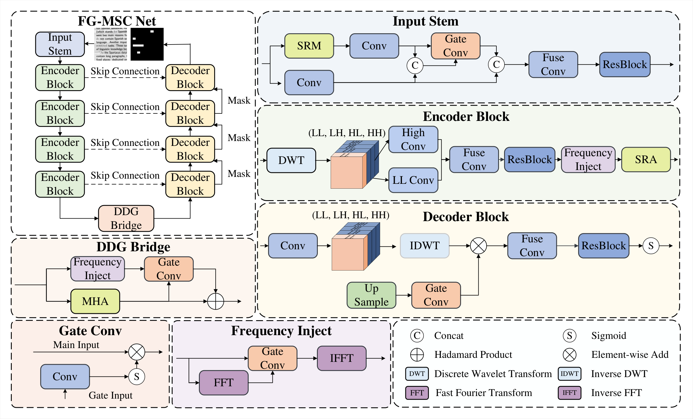

# FG-MSCNet

Frequency-Guided Multi-Scale Composite Network for document image tampering localization.

This repository is prepared for paper submission and focuses on reproducibility.

## Highlights

- Dual-stream input stem: RGB + SRM residual features.
- Wavelet-based encoder-decoder with DWT downsampling and IDWT upsampling.
- Frequency-guided spatial reduction attention (FG-SRA).
- Dual-domain gate bridge (spatial MHSA + learnable spectral filter).
- Multi-scale deep supervision with composite loss (BCE + Dice + Edge).

## Repository Status

- Paper link: coming soon
- Pretrained weights: [Google Drive](https://drive.google.com/file/d/1ZmInh8g5Af32r2AcGms8Jg1M46b7pgfe/view?usp=sharing)
- Inference demo script: coming soon

## Environment Setup

1. Clone the repo:

```bash
git clone https://github.com/<your-username>/FG-MSCNet.git
cd FG-MSCNet
```

2. Activate conda environment:

```bash
conda activate <your_env>
```

3. Install PyTorch first (matching your CUDA):
- https://pytorch.org/get-started/locally/

4. Install remaining dependencies:

```bash
pip install -r requirements.txt
```

## Dataset Layout

Use the DocTamper dataset with this directory layout:

```text
<data_dir>/
  DocTamperV1-TrainingSet/
  DocTamperV1-TestingSet/
  DocTamperV1-FCD/
  DocTamperV1-SCD/
```

LMDB keys expected by `dataset.py`:
- `num-samples`
- `image-%09d`
- `label-%09d`

## Training

Important: `train.py` uses distributed APIs internally. Run it with `torchrun` even on 1 GPU.

Single GPU:

```bash
torchrun --standalone --nproc_per_node=1 train.py \
  --data_dir <path/to/data_dir> \
  --exp_name fg_mscnet_exp1 \
  --runs_dir ./runs \
  --img_size 512 \
  --batch_size 2 \
  --epochs 200 \
  --lr 1e-4
```

Multi-GPU (example: 4 GPUs):

```bash
torchrun --standalone --nnodes=1 --nproc_per_node=4 train.py \
  --data_dir <path/to/data_dir> \
  --exp_name fg_mscnet_4gpu \
  --runs_dir ./runs
```

Resume full training state:

```bash
torchrun --standalone --nproc_per_node=1 train.py \
  --data_dir <path/to/data_dir> \
  --resume runs/<timestamp>_<exp_name>/checkpoints/last_model.pth
```

Load weights for finetuning:

```bash
torchrun --standalone --nproc_per_node=1 train.py \
  --data_dir <path/to/data_dir> \
  --finetune <path/to/checkpoint.pth>
```

Outputs are saved to:

```text
runs/<timestamp>_<exp_name>/
  logs/train.log
  tensorboard/
  checkpoints/best_model.pth
  checkpoints/last_model.pth
```

## Evaluation

Important: `eval.py` also uses distributed collectives. Use `torchrun`.

```bash
torchrun --standalone --nproc_per_node=1 eval.py \
  --data_dir <path/to/data_dir> \
  --checkpoint runs/<timestamp>_<exp_name>/checkpoints/best_model.pth \
  --img_size 512 \
  --save_dir ./eval_results \
  --save_n 50
```

Optional flag:

```bash
--pred_as_heatmap
```

Evaluation behavior:
- Tests on `fcd`, `scd`, and `test`.
- Searches threshold from `0.1` to `0.9` (step `0.1`) and reports the best F1 threshold.
- Prints a markdown-style metrics table:
  - F1, Precision, Recall, mIoU, Accuracy, AUC-ROC, AP.
- Saves visualization panels under `eval_results/<dataset_name>/`.

## Model Summary

```bash
python look.py
```

## Method Overview



```text
Input RGB
  -> InputStem (RGB + SRM fusion)
  -> Encoder x4 (DWT + FG-SRA)
  -> DDG Bridge
  -> Decoder x4 (IDWT + skip + mask guidance)
  -> Final head
Outputs: [H, H/2, H/4, H/8]
```

## Project Structure

```text
FG-MSCNet/
  layer/
    fg_mscnet.py
    modules.py
    dct.py
    srm.py
    wavelet.py
  dataset.py
  loss.py
  train.py
  eval.py
  look.py
  requirements.txt
  LICENSE
  README.md
```

## Results


| Dataset | F1 | Precision | Recall | mIoU | Pixel Acc | AUC-ROC | AP |
| --- | --- | --- | --- | --- | --- | --- | --- |
| FCD | 0.8483 | 0.9009 | 0.8016 | 0.7366 | 0.9898 | 0.9867 | 0.8803 |
| SCD | 0.9184 | 0.8703 | 0.9721 | 0.8491 | 0.9985 | 0.9995 | 0.9332 |
| TEST | 0.9714 | 0.9697 | 0.9730 | 0.9443 | 0.9993 | 0.9998 | 0.9926 |

## License

This project is released under the MIT License. See [LICENSE](LICENSE).
